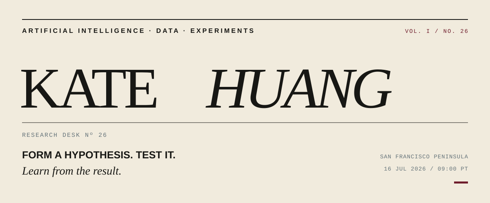
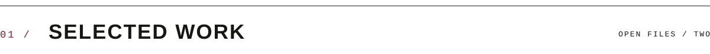

 

<table>
<tr>
<td width="20%" valign="top">DESK NOTE 16 JUL 2026</td>
<td width="80%" valign="top">

### Intelligence should be investigated, not merely asserted.

I build practical experiments with AI and data—systems designed to expose their failures, test a response, and improve through evidence.

</td>
</tr>
</table>

 

 

<table>
<tr>
<td width="13%" valign="top">FILE 01 ACTIVE</td>
<td width="87%" valign="top">

# [AUTOBENCH ↗](https://github.com/hkate1989/autobench)

**An experimental desk for research agents.** AutoBench observes benchmark failures, forms a concrete hypothesis, runs a bounded intervention, and keeps or rejects it according to measured performance.

RESEARCH AGENTS &nbsp; / &nbsp; EVALUATION &nbsp; / &nbsp; CONTROLLED EXPERIMENTS &nbsp; / &nbsp; JAVASCRIPT

</td>
</tr>
</table>

---

<table>
<tr>
<td width="13%" valign="top">FILE 02 PROTOTYPE</td>
<td width="87%" valign="top">

# [MISE ↗](https://github.com/hkate1989/codex-playground)

**A recipe reconstructed from sight and sound.** Mise turns an authorized cooking video into a structured, timestamped recipe using transcription, sampled frames, and independently validated model output.

MULTIMODAL AI &nbsp; / &nbsp; REACT &nbsp; / &nbsp; NODE.JS &nbsp; / &nbsp; STRUCTURED OUTPUT

</td>
</tr>
</table>

 

 

<table>
<tr>
<td width="20%" valign="top">METHOD</td>
<td width="80%" valign="top">Form the hypothesis. Build the smallest honest test. Measure what happened. Revise.</td>
</tr>
<tr>
<td valign="top">INQUIRIES</td>
<td valign="top">Research agents, multimodal products, and tools that make complex information useful.</td>
</tr>
<tr>
<td valign="top">AFTER HOURS</td>
<td valign="top">Cats, chess, poker, and longevity.</td>
</tr>
</table>

 

---

<table>
<tr>
<td width="50%">RESEARCH DESK / KH–26</td>
<td width="50%" align="right"><a href="mailto:qyhuang.work@gmail.com">CORRESPONDENCE ↗</a></td>
</tr>
</table>
